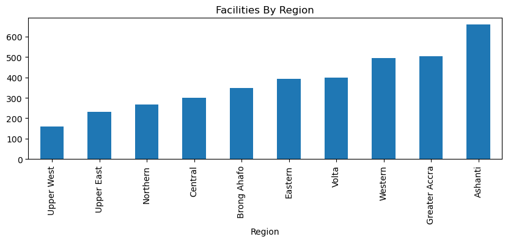

# Try-out Individual Project Uno:
# Data Cleaning & Graphication

## CSV FILES
This project cleans and graphically present data using the Ghana Health Data
* Ghana health facilities
* Ghana health facility by Tier

The necessary packages were defined and csv files were read.

The health facilities file was grouped by (Type) in order to access the different hospital facilities in Gh.

These various types(25 in all)were then minimized to 8 divisions using an array for a cleaner graphical presentation.
The most popular facility in Ghana is the Clinic of about 1200.

Ownership column was arrayed into 4 categories: Government, Private, Quasi-government,CHAG
Most of the owned health facilities is owned by the government(59%) and the least ownership is the Quasi_Government(collaboration between the government and private sector-2.42%)

Based on the graphical presentation grouped by region, Ashanti Region had the most facilities, followed by Greater Accra
with the least facilities in Upper West.

The two(2) csv files were merged- dropping columns:facility, one of the region and filling NA's 
Graphically implement the map to display the Ghana Health Facilities, by Type, Ownership and Tier

